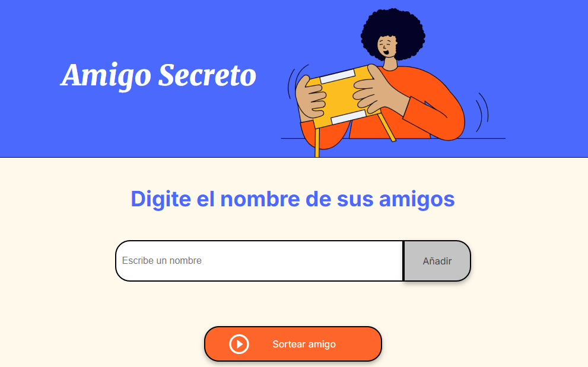

<h1 align="center"> Amigo Secreto </h1>
<h2 align="center"> Descripción </h2>
Aplicación desarrollada para permitir el ingreso de nombres de amigos en una lista para luego realizar el sorteo aleatorio y determinar quién es el "Amigo Secreto".
<h2 align="center"> Imagén del Proyecto </h2>

<h2 align="center"> Funcionalidades </h2>
- `Agregar Nombres`: Los usuarios escribiran el nombre de un amigo en un campo de texto y lo agregaran a una lista visible al hacer clic en "Adicionar" 1- 
`Validar entrada`: Si el campo de texto esta vacio, el programa mostrara una alerta pidiendo en nombre valido 2- 
`Visualizar la lista`: Los nobres ingresados apareceran en una lista debajo del campo de entrada  2- 
`Sorteo aleatorio`: Al hacer clic en el boton "Sortear Amigo", se seleccionara aleatoriamente un nombre de la lista y se mostrara en la pagina 3
<h2 align="center"> Como pueden usarlo los usuarios </h2>
<h2 align="center"> Donde pueden encontrar ayuda </h2>

